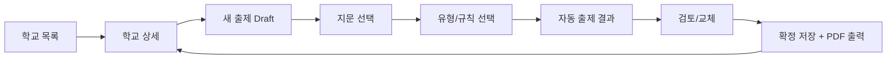
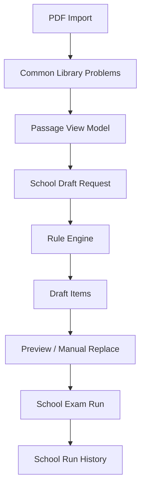

# 학교별 문제 출제 워크플로우 재설계

## 목표

- 현재의 `문제 라이브러리 -> 슬롯 생성 -> 교재/지문/유형 수동 배정` 흐름을 `학교 선택 -> 학교 규칙 선택 -> 지문 선택 -> 자동 출제 -> 검토/확정` 흐름으로 뒤집는다.
- 문제 원본은 학교별로 복제하지 않고, `공용 문제 라이브러리`를 단일 소스로 유지한다.
- 학교별 데이터는 `출제 규칙`, `출제 이력`, `작업 draft`만 저장한다.
- 서버형 공용 라이브러리는 나중 단계로 미루고, 이번 단계는 로컬 IndexedDB 기준 설계에 집중한다.

## 현재 구조 요약

현재 `app/index.html` 기준으로 이미 아래 기반은 갖춰져 있다.

- PDF import 시 문제를 `problem` / `shared` 단위로 분해한다.
- 각 문제는 `textbookName`, `worksheetFamily`, `worksheetRef`, `passageKey`, `passageLabel`, `problemType`, `subjectiveType`, `typeTags`를 가진다.
- IndexedDB에는 이미 `imports`, `problems`, `examSets`, `examItems`, `savedWorks` store가 있다.
- 시험지 생성은 `objective / subjective / tail` 슬롯을 먼저 만든 뒤, 각 슬롯마다 `교재 -> 지문 -> 유형`을 수동으로 골라 자동 배정하는 방식이다.
- 중복 방지는 현재도 일부 구현되어 있으며, `problemRecordId` 중복과 `passageTypeKey` 중복을 시험 이력 기준으로 차단한다.

즉, `공용 문제 라이브러리` 자체는 이미 꽤 잘 되어 있지만, 출제 UX의 시작점이 학교가 아니라 "문제 슬롯"이라서 실제 운영 흐름과 맞지 않는다.

## 재설계 원칙

1. 학교는 문제를 "소유"하지 않고 "참조"만 한다.
2. 출제 기준은 문제 개별 선택보다 `학교 규칙 + 선택 지문 + 유형 집합`이 우선이다.
3. 자동 출제 결과는 항상 draft로 먼저 만들고, 그 다음 검토/교체/확정한다.
4. 이전 출제 이력은 학교 단위로 관리한다.
5. 지문 중심 탐색이 기본이고, 문제는 지문 아래에 매달린 후보로 본다.
6. 로컬 버전에서도 나중에 서버 공용 라이브러리로 옮기기 쉬운 참조형 schema를 유지한다.

## 목표 사용자 흐름

### 1. 라이브러리 적재

이 단계는 현재 구조를 거의 유지한다.

- PDF import
- 문제/지문 추출
- 공용 라이브러리 저장

여기서 끝나는 데이터는 학교와 무관하다.

### 2. 학교 선택

출제 탭의 첫 화면은 `학교 목록` 또는 `학교 상세`가 된다.

- 학교 선택
- 최근 출제 이력 확인
- 기본 규칙 확인
- 새 출제 draft 시작

### 3. 지문 선택

학교 기준으로 라이브러리에서 지문을 선택한다.

- 교재 필터
- 지문 목록
- 지문별 사용 가능한 유형 미리보기
- 이전 출제 여부 표시

### 4. 출제 규칙 선택

출제는 아래 두 모드를 중심으로 단순화한다.

- `distinct_types_once`
  선택한 지문들에 존재하는 모든 유형을 모은 뒤, 유형당 1문제씩 자동 출제
- `full_by_passage_and_type`
  선택한 지문 + 선택한 유형 조합에 해당하는 문제를 전부 출제

보조 옵션:

- 제외할 유형 체크
- 이전 출제 문제 제외
- 같은 `지문+유형` 재사용도 막을지 여부

### 5. draft 생성

규칙 엔진이 공용 라이브러리에서 후보를 찾고 school draft를 만든다.

- draft에 자동 배정 결과 저장
- 부족한 유형/지문은 경고 표시
- 사용자가 개별 교체 가능

### 6. 검토/확정

- 미리보기
- 시험지 제목/부제 수정
- 확정 저장
- 학교 이력 반영
- PDF 출력

## 화면 흐름



## 권장 UI 구조

### 탭 1. 라이브러리 관리

현재 `PDF 제작` 탭의 역할을 유지한다.

- PDF 등록
- 문제 추출
- 공용 라이브러리 저장
- 라이브러리 통계 확인

### 탭 2. 학교별 출제

현재 `시험지 제작` 탭을 아래 구조로 바꾼다.

#### 좌측

- 학교 목록 / 학교 생성
- 학교 기본 규칙
- 최근 출제 이력
- 현재 draft 요약

#### 중앙

- 지문 선택 영역
- 유형 매트릭스
- 자동 출제 옵션

#### 우측

- 생성 결과
- 부족 항목 경고
- 개별 교체
- 미리보기
- 확정/출력

## 데이터 흐름



## 로컬 저장 구조 제안

### 유지

- `imports`
- `problems`

이 둘은 공용 라이브러리의 원본 store로 유지한다.

### 추가

- `schools`
- `schoolDrafts`
- `schoolExamRuns`
- `schoolExamRunItems`

### 선택적 추가

- `passages`

`passages`는 `problems`에서 계산 가능한 파생 store다. 초기 구현은 계산형 selector로 시작하고, 성능이 필요해지면 materialized store로 승격하는 편이 안전하다.

## store 역할

### `schools`

학교 단위 메타와 기본 규칙을 저장한다.

예시 필드:

```json
{
  "schoolId": "school-gangseo-a",
  "name": "강서A",
  "grade": "2",
  "term": "2학기",
  "defaultRule": {
    "mode": "distinct_types_once",
    "excludePreviouslyUsedProblems": true,
    "excludePreviouslyUsedPassageTypes": false
  },
  "createdAt": 0,
  "updatedAt": 0
}
```

### `schoolDrafts`

확정 전 작업 상태를 저장한다. 학교별 출제의 중심은 draft다.

예시 필드:

```json
{
  "draftId": "draft-123",
  "schoolId": "school-gangseo-a",
  "name": "gangseo-a-midterm",
  "request": {
    "selectedTextbooks": ["공통영어1 YBM"],
    "selectedPassageKeys": ["YBM::18", "YBM::20", "YBM::21"],
    "mode": "distinct_types_once",
    "includedTypes": ["주제", "제목", "빈칸", "삽입"],
    "excludedTypes": ["어휘"],
    "excludePreviouslyUsedProblems": true,
    "excludePreviouslyUsedPassageTypes": false
  },
  "generatedItems": [
    {
      "slotKey": "type::빈칸",
      "problemRecordId": "YBM::file1.pdf::problem-12",
      "passageKey": "YBM::20",
      "typeLabel": "빈칸",
      "status": "assigned"
    }
  ],
  "layoutSettings": {},
  "createdAt": 0,
  "updatedAt": 0
}
```

### `schoolExamRuns`

확정된 출제 이력의 header다.

예시 필드:

```json
{
  "runId": "run-123",
  "schoolId": "school-gangseo-a",
  "draftId": "draft-123",
  "title": "강서A 2차 시험",
  "mode": "distinct_types_once",
  "createdAt": 0,
  "updatedAt": 0,
  "totalCount": 12
}
```

### `schoolExamRunItems`

확정된 문제 참조 목록이다. 중복 차단은 이 store를 기준으로 한다.

예시 필드:

```json
{
  "entryId": "run-123::1",
  "runId": "run-123",
  "schoolId": "school-gangseo-a",
  "problemRecordId": "YBM::file1.pdf::problem-12",
  "passageKey": "YBM::20",
  "typeLabel": "빈칸",
  "passageTypeKey": "YBM::20::빈칸",
  "createdAt": 0
}
```

## 문제/지문 모델 분리

출제 화면은 문제 목록보다 지문 목록을 먼저 써야 한다. 따라서 UI selector 레벨에서 아래 구조를 만든다.

### `PassageSummary`

```json
{
  "passageKey": "YBM::20",
  "textbookName": "공통영어1 YBM",
  "passageLabel": "[18] 본문",
  "availableTypes": ["주제", "제목", "빈칸", "삽입"],
  "problemCount": 7,
  "usedProblemCountBySchool": 2,
  "usedPassageTypeCountBySchool": 1,
  "hasTailSet": false
}
```

핵심은 `problems` store를 그대로 두되, 학교 화면에서만 `PassageSummary[]`를 계산해서 쓴다는 점이다.

## 출제 모드 상세

### A. `distinct_types_once`

의도:

- 선택한 지문들에 존재하는 모든 유형을 모은다.
- 유형당 1문제씩만 뽑는다.

처리 순서:

1. 선택 지문들의 `availableTypes`를 union 한다.
2. 기본값은 전부 선택 상태로 둔다.
3. 사용자가 제외할 유형을 해제한다.
4. 각 유형마다 후보 문제를 모은다.
5. 학교 이력 제외 규칙을 적용한다.
6. 유형별 1문제를 자동 배정한다.

권장 배정 우선순위:

1. 현재 draft에서 아직 쓰지 않은 지문 우선
2. 해당 학교에서 덜 사용된 지문 우선
3. 이전에 안 나온 문제 우선
4. 동률이면 랜덤

이 모드가 이번 요구사항의 기본값이 된다.

### B. `excluded_types`

별도 모드가 아니라 `distinct_types_once`의 내장 단계로 처리하는 것이 맞다.

- 유형 매트릭스는 기본 전체 선택
- 사용자는 빼고 싶은 유형만 해제
- 결과는 즉시 재계산

즉, 기능 2는 기능 1의 후속 필터로 흡수한다.

### C. `full_by_passage_and_type`

의도:

- 선택한 지문들에서
- 선택한 유형들에 해당하는 문제를
- 전부 출제한다.

처리 규칙:

- 선택 지문과 선택 유형의 교집합에 있는 모든 문제를 draft에 넣는다.
- 같은 유형이 같은 지문에 2개 이상 있으면 모두 포함한다.
- 이력 제외 옵션이 켜져 있으면 제외 후 남은 문제만 포함한다.
- 제외 때문에 비어버린 `지문+유형`은 "누락" 상태로 보여준다.

이 모드는 대량 제작이나 보강 자료에 적합하다.

## 이전 출제 제외 정책

이번 단계에서 기본 정책은 학교 단위로 둔다.

### 기본 옵션

- `excludePreviouslyUsedProblems`
  정확히 같은 `problemRecordId`는 제외

### 확장 옵션

- `excludePreviouslyUsedPassageTypes`
  같은 `passageKey + typeLabel` 조합도 제외

권장 기본값:

- `excludePreviouslyUsedProblems = true`
- `excludePreviouslyUsedPassageTypes = false`

이유:

- exact problem 중복은 강하게 막아야 한다.
- 같은 지문의 같은 유형까지 항상 막아버리면 후보 풀이 지나치게 좁아질 수 있다.
- 다만 학교 성향상 더 강한 차단이 필요하면 고급 옵션으로 열어두는 게 좋다.

## draft와 확정(run)의 분리

반드시 분리해야 한다.

- draft는 실험 가능한 작업 상태다.
- run은 실제 출제 이력이다.

중복 차단은 `draft`가 아니라 `확정된 run` 기준으로만 계산해야 한다.

이렇게 해야:

- 사용자가 draft를 여러 번 생성해도 이력이 오염되지 않고
- 최종 확정한 시험지만 학교 이력으로 남는다.

## 현재 구조에서 재사용 가능한 부분

### 그대로 활용 가능

- PDF import / 문제 추출 로직
- `problems` 저장 구조
- 문제 유형 분류 로직
- 미리보기 렌더링
- HTML/PDF 출력

### 재구성 필요

- `examLibraryList`
  교재 카드 목록에서 학교 중심 화면으로 변경
- `createExamSlotsFromInputs`
  슬롯 생성 중심 접근 제거
- `assignProblemToExamSlot`
  단일 슬롯 배정 함수에서 `draft generation engine`으로 확장
- `persistExamHistory`
  학교 run 중심 저장으로 변경
- `saveCurrentExamWork`
  학교 draft 저장 방식으로 변경

## 구현 단계 제안

### 1단계. 데이터 계층 분리

- `schools`, `schoolDrafts`, `schoolExamRuns`, `schoolExamRunItems` store 추가
- `problemRecords -> PassageSummary[]` selector 작성
- 학교별 history query helper 작성

### 2단계. 생성 엔진 작성

- `distinct_types_once` 생성 함수
- `full_by_passage_and_type` 생성 함수
- history exclusion 필터 작성
- draft item status 모델 작성

### 3단계. 화면 전환

- 시험지 제작 탭을 학교 중심 step flow로 교체
- 학교 선택 / 지문 선택 / 유형 매트릭스 / draft 결과 화면 구성

### 4단계. 확정/출력 연결

- draft -> preview -> run commit 연결
- PDF 출력 후 run 저장
- 학교별 최근 이력/재출제 차단 표시

### 5단계. 이후 서버 이전 대비

- `problemRecordId`, `schoolId`, `runId`를 모두 참조형 key로 유지
- 학교 데이터와 라이브러리 데이터를 분리된 payload로 유지
- sync 대상은 나중에 `libraries`, `schools`, `runs` 단위로 나눌 수 있게 설계

## 이번 설계에서의 판단

- 학교별로 문제를 복제 저장하지 않는다.
- 학교별 규칙은 `school.defaultRule + draft override` 구조로 간다.
- 기능 2는 별도 모드가 아니라 `유형 체크 해제`로 통합한다.
- 이전 출제 제외는 우선 `문제 중복 제외`를 기본으로 한다.
- `passages` store는 필수는 아니고, 먼저 selector 기반으로 구현한다.

## 바로 다음 구현에서 건드릴 핵심 지점

- `refreshLibrarySummary()` 이후에 학교용 selector 계층 추가
- 현재 `renderExamLibraryList()`를 학교 목록 + 지문 목록 구조로 대체
- 현재 슬롯 state(`state.examBuilder.slots`)를 `state.schoolDraft` 구조로 교체
- 현재 `examSets / examItems`를 학교 run 개념으로 정리

## 요약

핵심 전환은 단 하나다.

- 현재: `문제 라이브러리에서 슬롯을 채워 시험지를 만든다`
- 목표: `학교가 필요한 규칙을 고르면 공용 라이브러리에서 자동으로 문제를 조합한다`

이 전환만 지키면, 로컬 구조로 먼저 구현해도 나중에 서버형 공용 라이브러리로 확장하기 쉬워진다.
